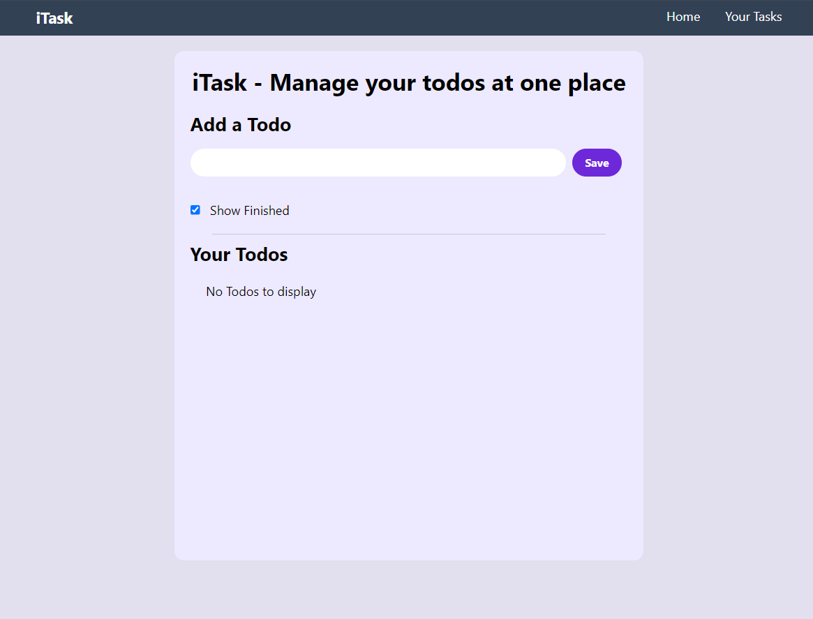

# Task - Todo List App
iTask is a simple todo list application built with React, Vite, Tailwind CSS, and React Icons. It helps you organize your tasks efficiently.


## Features
Add, edit, and delete tasks
Mark tasks as complete
Filter tasks by status (all, active, completed)
Responsive design for desktop and mobile
## Technologies Used
React: A JavaScript library for building user interfaces.
Vite: A fast build tool for modern web development.
Tailwind CSS: A utility-first CSS framework for rapid UI development.
React Icons: A library of popular icons for React projects.
## Getting Started
To get a local copy up and running, follow these steps:

1. Clone the repository:

```bash
git clone https://github.com/your-username/iTask.git
cd iTask
```

2. Install dependencies:

```bash
npm install
```
3. Run the development server:

```bash
npm run dev
```

Open http://localhost:3000 in your browser to see the app.

### Usage
● Adding a Task: Enter a task in the input field and press Enter or click the Add button.

● Editing a Task: Double-click on a task to edit it.

● Marking a Task as Complete: Click on the checkbox next to a task.

● Filtering Tasks: Use the buttons at the bottom to filter tasks by status (All, Active, Completed).

● Deleting a Task: Click on the delete button (trash icon) next to a task to remove it.

Screenshots


### Contributing
Contributions are welcome! Please follow these steps:

1. Fork the project
2. Create your feature branch (git checkout -b feature/AmazingFeature)
3. Commit your changes (git commit -m 'Add some AmazingFeature')
4. Push to the branch (git push origin feature/AmazingFeature)
5. Open a pull request